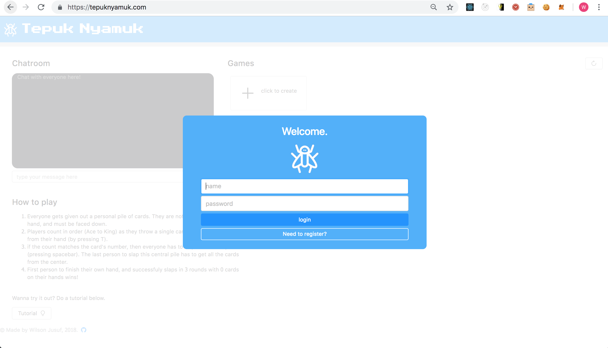
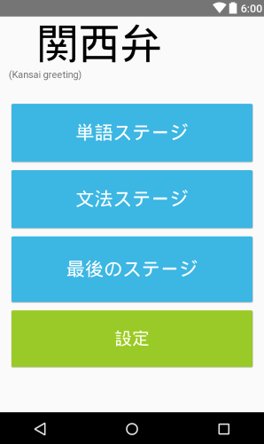
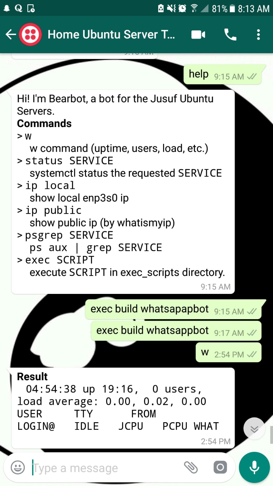

**<u>Portfolio of Wilson Jusuf</u>**

**Linkedin**: https://www.linkedin.com/in/wilsonjusuf/

**Github**: https://github.com/willyspinner
**Resume**:https://github.com/willyspinner/portfolio/blob/master/2018_wilson_jusuf_resume.pdf

**Email**: wilsonjusuf1998@gmail.com
# <u> Ongoing Projects </u> 

## Missing Child - IBM Call for Code 2019 

We develop a Machine Learning Algorithm to recognize parent-child relationships by using the FIW dataset. We are able to gain a 86% accuracy in relationship verification.

We are continuing the devlopment of this project by fine-tuning networks, creating a mobile frontend and developing a scalable backend to realize this project.

see https://github.com/willyspinner/missing-child for more info!

# <u>Past projects</u> 

## tokopedia.com (2018)

For three months (June 2018 - September 2018), I interned as a software engineer in Tokopedia, Indonesia's biggest e-commerce platform. I accomplished the folllowing:

- Initiated a front-end migration project for tokopedia's chat service to React, ES6 & Webpack from an outdated PERL and ES5 React codebase. 
- Created the entire project infrastructure: Optimized the webpack build process, created a golang frontend-server that serves the content, strategized staging & production deployment with devops engineers, and tested new features.
- Implemented a new chat-widget feature (shown below, outlined in red) in the tokopedia.com homepage, which is built with this migration project. This allows the users to chat with merchants easily - affecting 50+ million users.  I lead this project, and worked with devops engineers (as above) and frontend designers to discuss useability, look and functionality.
- In the span of 3 months, this project achieved 75KB gzipped size reduction for production-ready assets, and updated the severely outdated frontend stack with more modern, optimized tools. It also eased the path for future frontend development in tokopedia with an easier workflow and coding style.

## tepuknyamuk.com (2017 - 2018)

**This website is Live @**: [tepuknyamuk.com](https://tepuknyamuk.com) (you will need someone to play with)

**Repository and Documentation**: [github.com/willyspinner/tepuk-nyamuk](https://github.com/willyspinner/tepuk-nyamuk)

A personal project of mine, I fully designed, architected, and programmed this online, multi-player, and real-time indonesian card game which is currently hosted in DigitalOcean San Francisco. I used some of my free time in winter and spring quarter to develop this game after learning about advanced web development concepts such as websockets, in-memory databases (redis) and frontend development with React.js.

The aim of 'tepuk-nyamuk' (literally, mosquito slapping) is to count from Ace to king repeatedly and throw an unseen card from your hand to a central pile. When the card and count matches, everyone must slap the pile. The last one to slap has to take all of it. The winner is the person who finishes their hand, and slaps three times afterwards (streaks).

The game has a leveling system. A user's level is dictated by experience points. The game also has advanced features such as handling extreme cases when, for example, a user leaves a game midway, or when users suddenly have internet connection problems in the game lobby before starting a game.

Below is the in game screen:

Shown below is the main screen, where you would see available games in real time and chat with other players.

 Finally, below is the game lobby where players wait for the gamemaster to start.

## textpert Audio Machine Learning project (2017-2018)

- Over the course of Winter quarter, and early Spring quarter, I spearheaded the Audio Machine Learning Project of AIME, Textpert's Artificial Intelligence Mental Evaluation product.
- I Worked on developing LSTM networks to create an Audio Classification PoC that classifies whether someone is depressed or not.
- I Contributed to the data processing pipeline end-to-end; I processed data from audio files to ready-to-train datasets, after careful feature selection and extraction.

## gojek -Sentiment analysis project (2017)

I teamed up with the Social Media Analytics team to analyze Facebook and Twitter feedback for GOJEK, Indonesia's largest transportation-based startup. Contribured to sentiment classification using LSTMs and neural networks implemented in tflearn library. Optimized to classify with 78% accuracy with all Indonesian comments.

## KansaiBen app (android) (2016-2017)

I created an android mobile app that enabled japanese language learners to learn the kansai dialect of Japan. I myself enjoy learning languages, and in particular enjoy learning about japanese and its culture. The kansai dialect is one I am interested in, and so I made an app that gamified learning the vocabulary (単語) and grammar 文法), all culminating in a challenge stage that had both.

# <u>ongoing projects</u>

## WhatsApp Chatbot (2018 - present)

Whatsapp is a popular mobile messaging platform used in Indonesia. I am currently creating a chat bot using whatsapp that resides in my self hosted servers I have back home (Indonesia). The goal of this chat bot is to automate repetitive tasks in the software development lifecycle, such as running builds, deployments, and checking system status. Instead of remotely logging on to the server, we would issue commands to the chat bot in a secure (2FA enforced) manner to execute tasks, wherever and whenever we want.

**Repository and Documentation**:https://github.com/willyspinner/whatsappbot

## automated trading (Automatrade) - (2018 - present)

Although a long shot, I am taking on the challenge of exploring the world of Fintech by building a platform for me to develop stock and forex investment algorithms. The goal of this project would be to ease the process of conducting experiments with different investment strategies, and seeing how it performs with time. I wrote a usable API that allows people to create their own algorithms ('decision engines' - see below) that adhere to a set of rules, suggesting actions to buy or sell securities.

# <u>skillsets</u>

I maintain a multidisciplinary and flexible approach to developing applications. I am proficient in the three main areas of web development, and plan to continue developing skills to understand how the three interact together in iterating, testing and managing a product. The areas are: 

- infrastructure management (sysadmin/devops)
- business logic development (backend development)
- front-facing application development (frontend development)

## Infrastructure

| skill                                                     | description of skill                                         |
| --------------------------------------------------------- | ------------------------------------------------------------ |
| Ubuntu Server Administration                              | the use of Ubuntu OS to manage tech infrastructure e.g. servers, databases, files, networking, daemons |
| General Linux                                             | 'Muscle-memory' Knowledge of command line e.g. file systems, security, scheduling jobs, etc. |
| VPN administration                                        | Setting up a secure network for accessing infrastructure that is impenetrable from outsiders. |
| Secure SSH/Teleport administration                        | Establishing secure remote access system to infrastructure to allow security policies such as RBAC, so that we can manage infrastructure anywhere, anytime. |
| Cloud infrastructure - DigitalOcean, AWS                  | Setting up infrastructure in cloud providers such as DigitalOcean, AWS. |
| Domain Name / DNS administration & SSL/TLS administration | Working with domain name providers such as namecheap and godaddy, DNS to launch a business' domain name, and to enable SSL/TLS for secure and trusted communication with the client and the server. |
| Jenkins build server (Basics)                             | Setting up build and deploy jobs that can be automated.      |

## Frontend

| skill                                                   | description of skill                                         |
| ------------------------------------------------------- | ------------------------------------------------------------ |
| ES6 React.js                                            | My main framework for building modern and interactive web frontends. |
| Webpack                                                 | For building JS and CSS assets into deployable bundles to be served in the web server. |
| React.js component frameworks - antd, blueprintjs       | For rapid prototyping and designing, I am able to use component frameworks to create a mockup quickly. |
| Jquery                                                  | DOM manipulation and interactivity using jquery.             |
| CSS, HTML, JS                                           | The basic building blocks of the web.                        |
| Testing with mocha, jest, enzyme                        | Unit testing, snapshot testing and mocking libraries.        |
| production ready deployment (experience from tokopedia) | Minification (using webpack), bundle analysis, component/route level code-splitting, using GZIP compression, caching, web servers (ties to NGINX - backend) |
| Native Android Development                              | A mobile framework that I use to build the japanese language application. |
| React Native                                            | The react framework used for mobile that I learned to create similar frontend code to react.js. |

## Backend

| skill                                                        | description                                                  |
| ------------------------------------------------------------ | ------------------------------------------------------------ |
| Nginx as a web/proxy server, load balancer & TLS/SSL offloader | Using nginx as an effective front-facing web server to the outside world. |
| Websockets                                                   | Enabling realtime bidirectional communication between client and server (featured prominently in the tepuknyamuk.com game). |
| Message Queues - RabbitMQ                                    | Utilizing MQs as a reliable broker to manage inter-service communication. |
| Golang web stack                                             | Using golang to build web apps/microservices, REST APIs.     |
| Nodejs express stack                                         | the same as golang, but with the node.js ecosystem, and additionally,  clustering. |
| Caching & KV databases - redis                               | Caching database queries, results, sessions.                 |
| SQL databases - PostgreSQL                                   | DB management - transactions.                                |
| NoSQL databases - MongoDB                                    | DB management.                                               |
| Service discovery - consul                                   | inter-service discovery and configuration for distributed microservices. |

## machine learning

I am proficient in using Keras with python to prototype applications powered by neural networks, having built a prototype LSTM networks in Gojek, to analyze the sentiment of comments for customer service and Textpert, where I made a POC audio NN to classify depression.

I am comfortable in using Keras, Tneosrflow, and TFLearn (tensorflow) to use models of Linear Regression, Classification, NNs, RNNs, LSTMs and word2vec.

 ## general languages

| language                | description of skill                                         |
| ----------------------- | ------------------------------------------------------------ |
| bash                    | Bash is my everyday language; it ranges from automating mundane and repetitive tasks by writing shell scripts to configuring and managing metal ubuntu servers at home from the ground up. |
| python                  | I am proficient in python after accomplishing machine learning and data engineering tasks in textpert as well as gojek. |
| Java                    | Java is my first langauge  and I used it on the japanese language android app (described above). |
| Javascript (&  Node.JS) | While I use javascript to code frontend in react, I also use it for fast prototyping backends in node.js. |
| golang                  | After using golang in my tokopedia internship, it is now my primary langauge of choice for backends as I believe it to be the perfect blend of code elegance and strictness. |
| C & C++                 | Freshman year was spent relearning basic OOP and programming skills with C and C++. I am also aware of performance optimization issues and solutions when using these languages. |

## version control

I am proficient in versioning projects, having worked with git in either github or gitlab for all my projects and internships.
